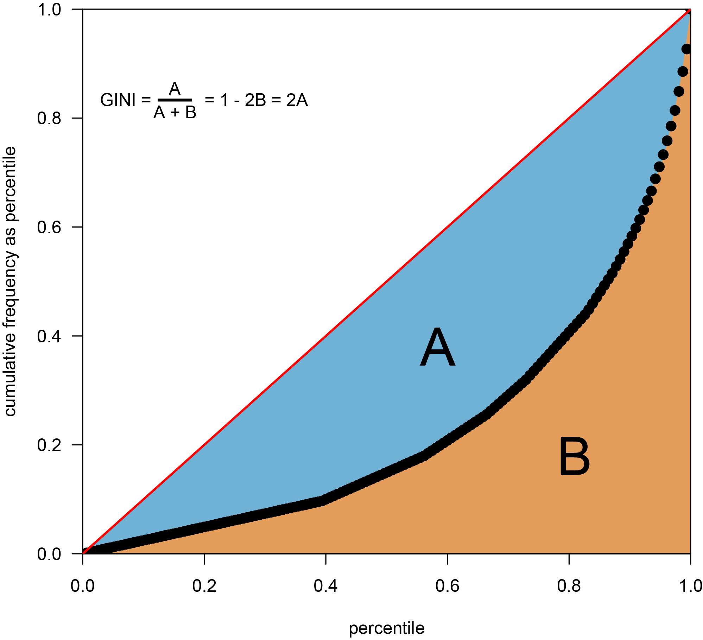
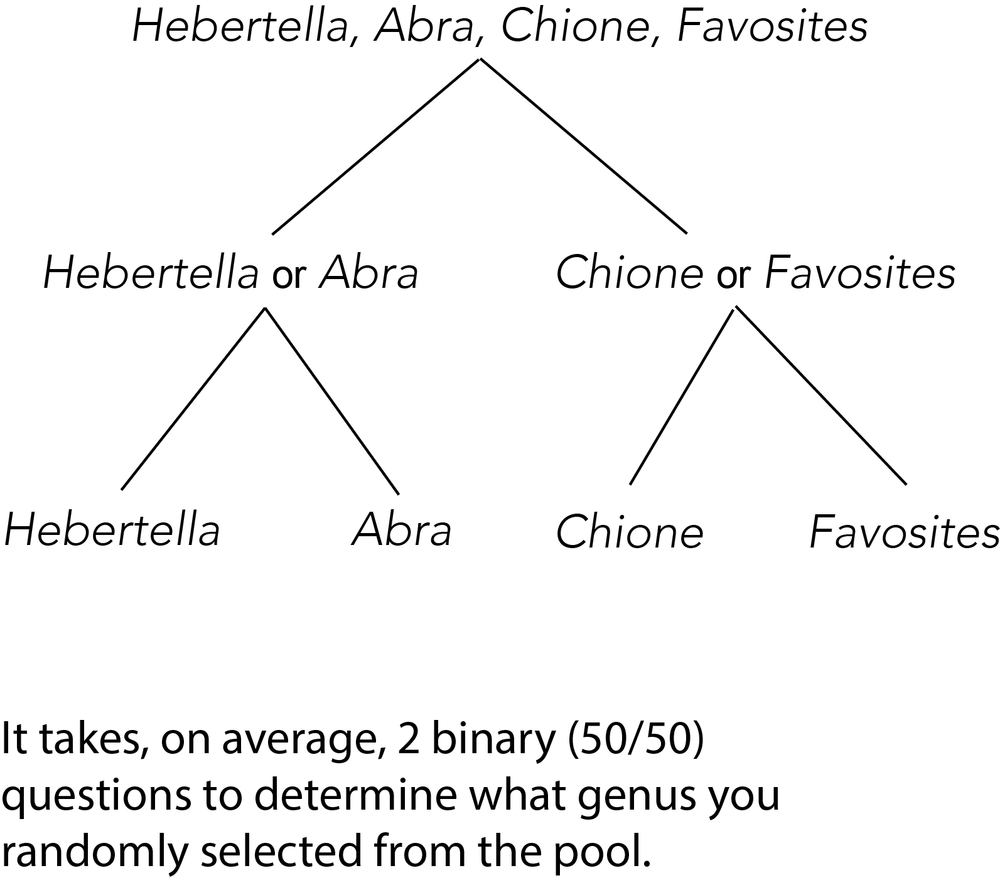
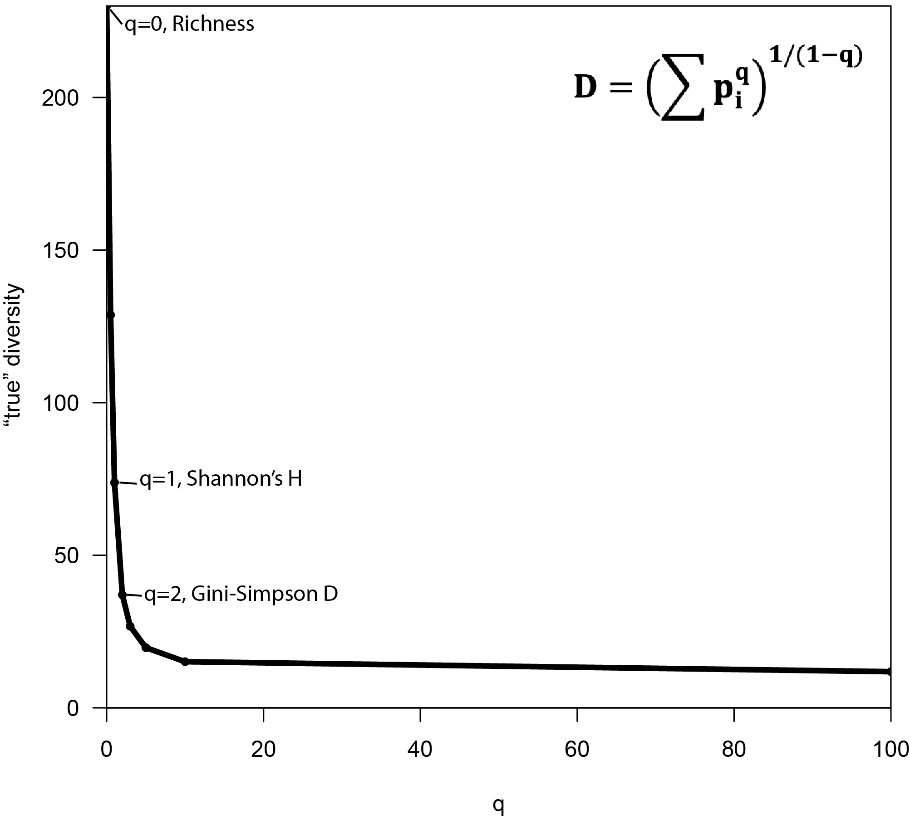
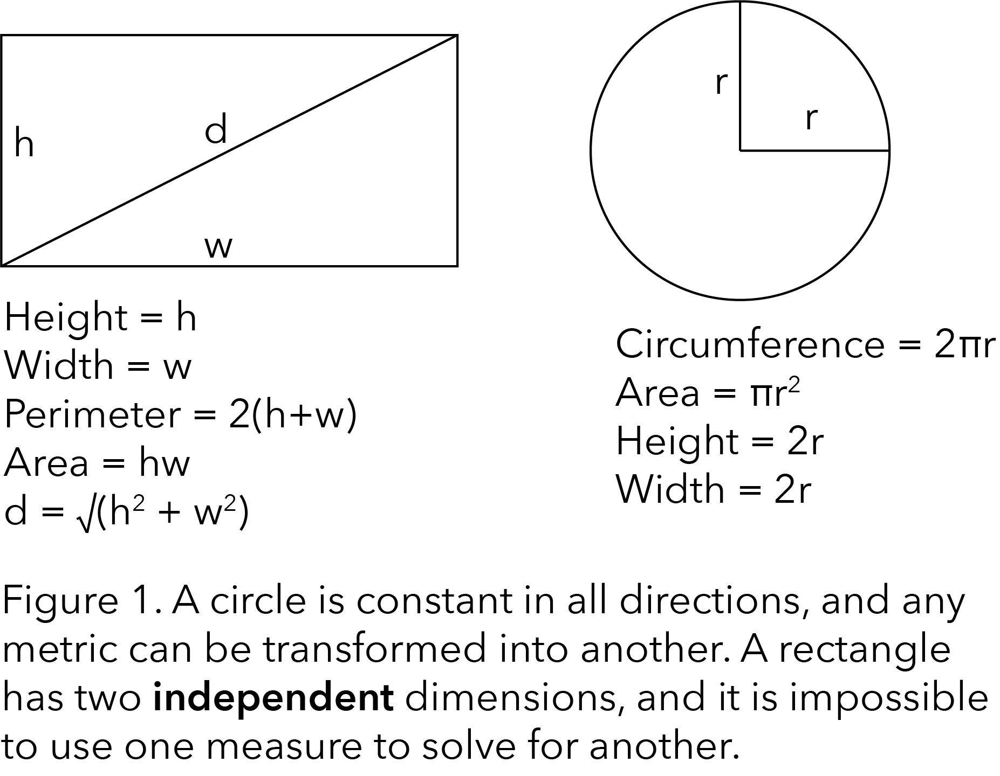
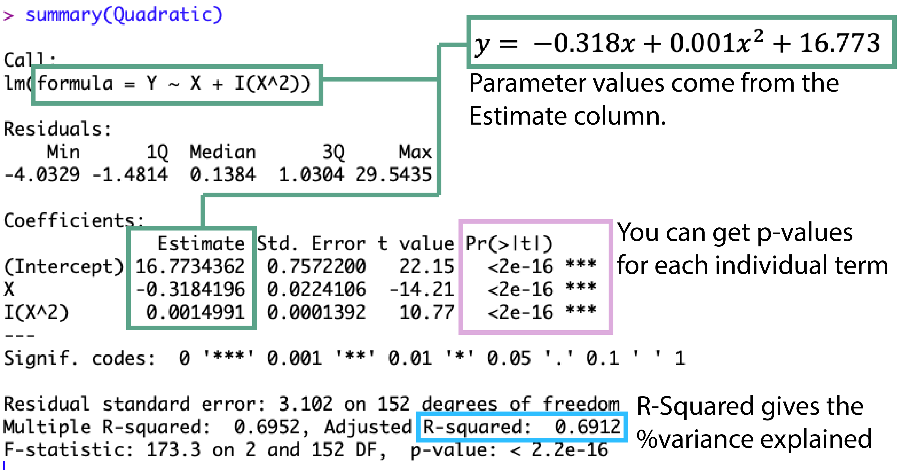
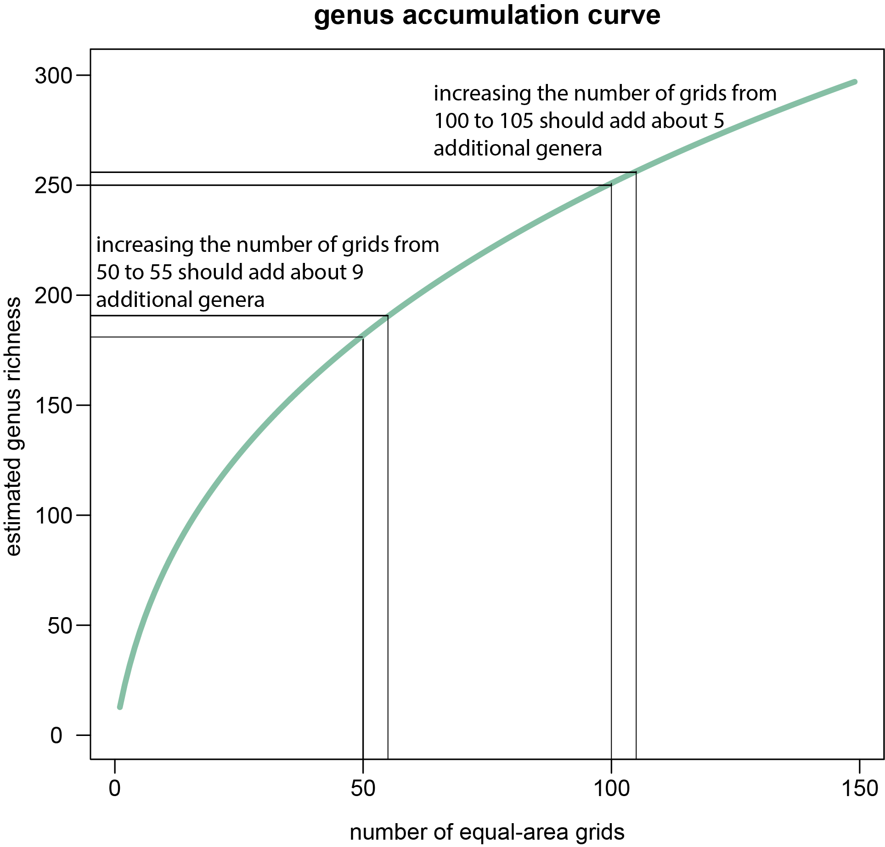
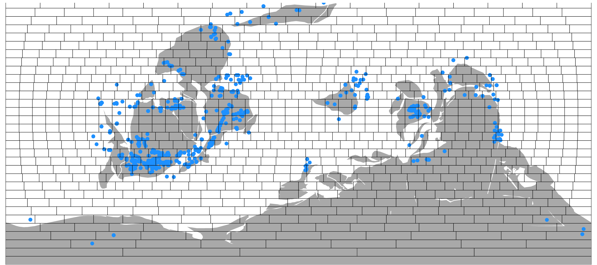

## Table of Contents
- [Configuring R Environment](#configure-r)
- [Richness I: Introduction](#richness-introduction)
  - [Richness I: Questions I](#richness-questions-i)
  - [Richness I: "Downside"](#richness-downside)
  - [Richness I: Questions II](#richness-questions-ii)
- [Frequency Distributions: Introduction](#frequency-distribution-introduction)
  - [Frequency Distributions: Questions I](#frequency-distribution-questions-i)
  - [Frequency Distributions: Proper Visualization](#frequency-distribution-proper-visualization)
  - [Frequency Distributions: Questions II](#frequency-distribution-questions-ii)
- [Evenness: Introduction](#evenness-introduction)
  - [Evenness: Questions](#evenness-questions)
- [Probability of Encounter: Introduction](#probability-of-encounter-introduction)
  - [Probability of Encounter: Questions](#probability-of-encounter-questions)
- [Entropy: Introduction](#entropy-introduction)
  - [Entropy: Questions](#entropy-questions)
- [Hill Numbers: Introduction](#hill-numbers-introduction)
  - [Hill Numbers: Questions](#hill-numbers-questions)
- [Frequency Distributions II: Linear Models](#frequency-distributions-ii-linear-models)
  - [Frequency Distributions II: Questions I](#frequency-distributions-ii-questions-i)
- [Sampling Standardization: Introduction](#sampling-standardization-introduction)
  -[Sampling Standardization: Questions I](#sampling-standardization-questions-i)
  -[Sampling Standardization: Area Revisited](#sampling-standardization-area-revisited)
  -[Sampling Standardization: Subsampling](#sampling-tandardization-Subsampling)
  -[Sampling Standardization: Questions II](#sampling-standardization-questions-ii)
- [Extrapolation: Introduction]()
  - [Extrapolation: Richness]()
  - [Extrapolation: Frequency Distributions]()
- [Temporal Dynamics: Introduction]()
  - [Temporal Dynamics: Boundary Categories]()
  - [Temporal Dynamics: Turnover Rates]()
  - [Temporal Dynamics: Questions](#temporal-dynamics-questions)
- [Spatial Dynamics: Alpha, Beta, and Gamma]()
  - [Spatial Dynamics: Questions]()
- [Time Series: Introduction]()
  - [Time Series: Autocorrelation]()
  - [Time Series: Periodicity]()
  - [Time Series: Correlation]()
- [Birth-Death Model: Introduction]()
- [Trajectory of Phanerozoic Biodiversity]()

## Configure R
Download the `velociraptr` package from CRAN and change the download timeout. You can always check your currently active libraries with `installed.packages()` or `sessionInfo()`. Also, note the difference between `require()` and `library()` and how this is used in the configuration script.

````R
# This will check if you have the velociraptr package installed
# It not, it will download, install, and activate it
# If you already have it installed, then it will simply activate it.
if (suppressWarnings(require("velociraptr"))==FALSE) {
    install.packages("velociraptr",repos="http://cran.cnr.berkeley.edu/");
    library("velociraptr");
    }

# vegan is a popular ecoinformatics package
if (suppressWarnings(require("vegan"))==FALSE) {
    install.packages("vegan",repos="http://cran.cnr.berkeley.edu/");
    library("vegan");
    }

# DescTools is an extemely popular package of cross-disciplinary summary statistics
if (suppressWarnings(require("DescTools"))==FALSE) {
    install.packages("DescTools",repos="http://cran.cnr.berkeley.edu/");
    library("DescTools");
    }

# sf is an extemely popular package for geographic (GIS) analysis
if (suppressWarnings(require("sf"))==FALSE) {
    install.packages("sf",repos="http://cran.cnr.berkeley.edu/");
    library("sf");
    }

# Change the maximum timeout t0 300 second. This will allow you to download larger datafiles from 
# the paleobiology database.
options(timeout=300)

# Functions are camelCase. Variables and Data Structures are PascalCase
# Fields generally follow snake_case for better SQL compatibility
# Dependency functions are not embedded in master functions
# []-notation is used wherever possible, and $-notation is avoided.
# []-notation is slower, but more explicit and works for atomic vectors
````

## Richness: Introduction
The simplest and most common biodiveristy metric is *richness*. Richness is applicable to any categorical dataset, and is simply the total number of categories. Let's begin by downloading a dataset of all Pleistocene mammal genera in the Paleobiology Database.

````R
# Download all representatives of mammalia that are withint he Pleistocnee boundary
Mammals = velociraptr::downloadPBDB(Taxa="Mammalia",StartInterval="Pleistocene",StopInterval="Pleistocene")
````

Take some time to examine this dataset. It is always worth taking time to familiarize yourself with a dataset *before* you commit
to an analysis. Here are some functions that you may find useful for quickly perusing the data: `head()`, `dim()`, `table()`, `subset()`, and `unique()`. Remember, you can always learn more about a particular funciton by using `help()` or `?`.

### Richness: Questions I
1. How many fossil occurrences are in this dataset? 
2. How many paleobiology database collections are in this dataset?
3. What is the species richness, genus richnss, and family richness of this dataset?
4. What is the species richness of the family Vespertilionidae?
5. Which family has the highest genus richness? - hint: look at the function `tapply()`
6. Closely inspect the text values in the family, genus, and accepted_name fields. Can you see any problems with the quality of these data?

## Richness: "Downside"
One significant "downside" of richness is that it is very sensitive to sampling *effort*. The more effort one spends to identify species within a sample, the more species that are likely to be found. This, by itself, really isn't really a problem since this will be true for any statistical sample of a population; however, there are two properties of taxonomic data that make it difficult to correct for this problem.

1. The relationship of richness to sampling effort is *non-linear* and unique to each sample. This means that it is potentially *very* inaccurate to standardize sampling effort using a constant. For example, you cannot simply divide the richness of samples by their respective weights because the expected number of new species per unit of weight is not constant within or among samples.
2. Consistent data on the sampling effort used to collect data within samples is rarely (almost never) collected or reported. This gnerally means that an assumed proxy for sampling effort must be used (e.g., the number of individuals collected per sample, the areal extent of samples). Unfortunately, the actual relationship of these proxies to sampling effort will vary from sample to sample. For example, just because Sample A was collected over a larger area than Sample B, does not necessarily mean that more *effort* was spent cataloguing the species in Sample A than B.

Let's simulate some data to understand the basic difficulties of measuring richness.

````R
# Set the seed for your randomization procedure, this way everyone will get the exact same
# result, even though we are technically "randomly" sampling
set.seed(42)

# Use the sample() function to randomly sample letters from the alphabet
# The letters variable comes preloaded in r.
Fake = sample(letters, 26, replace=TRUE)

# Display the unique letters sampled
unique(Fake)

# Display how many of each letter was sampled
table(Fake)
````

Notice that even though we sampled from a [discrete uniform distribution](https://en.wikipedia.org/wiki/Discrete_uniform_distribution) of letters - i.e., all letters had an equal probability of being sampled - we did not sample all 26 letters of the alphabet. Furthermore, some letters were sampled multiple times, giving the impression that some letters (species) are more abundant than others dsepite all letters actually being equally abundant.

**We will revisit this problem and discuss some solutions in a later exercise.**

### Richness: Questions II

Let's consider what would happen if we assumed that our sample was actually an accurate representation of the underlying frequency distribution of letters in the population, and we used that data to power an analysis.

````R
set.seed(88)

# Create a new distribution to sample from, see the previous code-block to see where the object Fake comes from.
Resample = rep(x=names(table(Fake)),times=table(Fake))

# Sample 26 times from the new distribution, as we did previously
DoubleFake = sample(Resample, 26, replace=TRUE)
````

1. The varaible Resample was created using the functions `rep()`, `names()`, and `table()`. Additionally, the function `rep()`, used the arguuments `x` and `times`. Can you describe the role of these functions and arguments in this script?
2. What was the richness and the frequency distribution of the new sample DoubleFake? How did this compare to the original population?

We will talk about the problem of richness more in depth in a later exercise, and ~~better~~ common methods to account for the sampling effort problem.

## Frequency Distribution: Introduction
As you may have seen from the previous exercise, even very small changes in the frequency distribution (i.e., how often each species occurs in the dataset) can dramatically impact estimated richness. More abundant taxa are more likely to be sampled and less abundant taxa are less likely to be sampled. Therefore, it is often worth analyzing the frequency distribution.

Let's start by creating a few fake datasets for comparison. **We'll talk about more robust ways to create fake datasets and various random distributions in a later exercise.**

````R
# Discrete Uniform
Uniform = letters

# Power distribution
Power = rep(letters, times=(1:26)^2)

# Linear Distribution
Linear = rep(letters,times=1:26)
````

### Frequency Distribution: Questions I
1. Take a randomized "samples" of each of the three populations using the `sample()` function. Let your sample size be 52 for each.
2. Use the following functions, `density()` and `hist()` to view the [frequency distributions](https://www.statmethods.net/graphs/density.html) of each sample. Describe the general shape of each.
3. Which of your samples gave the most accurate view of the true richness, which gave the least? Why do you think that is?
4. Calculate basic summary statistics for each of your random samples - mean, median, standard deviation, variance, skew, and kurtosis.
5. If you were only given the moments for each of your sampled distributions, could you infer the shape of the original distribution? Which moments would you need at minimum?

## Frequency Distribution: Proper Visualization
Kernel density (`density()` and histograms (`hist()`) are extremely popular for analyzing frequency distributions, but suffer from some clear problems. Namely, they both apply an arbitrary binning of the data. The [most robust methods](http://brian-mcgill-4.ums.maine.edu/sad_review.pdf) for plotting frequency distribution in ecological data are Rank Abundance Diagrams (RADs) and Lorenz Curves.

Let's make a simple RAD and a simple Lorenz Curve

````R
# Let's use some real data this time
Bryozoa = velociraptr::downloadPBDB(Taxa="Bryozoa",StartInterval="Bartonian",StopInterval="Priabonian")
# Clean out the subgenera and blanks
Bryozoa = cleanTaxonomy(Bryozoa,Taxonomy="genus")

# Create a frequency distribution of the genus occurrences with table(), and sort() it from most abundant to 
# least abundant. Note, that some workers prefer to sort from least abundant to most when plotting.
Frequencies = sort(table(Bryozoa[,"genus"]),decreasing=TRUE)

# Make a rank abundance diagram. 
plot(y=as.vector(Frequencies),
	x=1:length(Frequencies),
	xlab="order from most abundant to least abundant",
	ylab="genus frequency",
	las=1,xaxs="i",yaxs="i",pch=16,cex=1.5,
	xlim=c(0,length(Frequencies)),ylim=c(0,50)
	)	
````

Notice that the shape of the diagram is *strongly* non-linear. There are only a handful of very abundant genera, and many very rare genera. This distribution of few abundant taxa and many rare taxa is colloquially known as a "hollow curve" and is *ubiquitous* in ecological datasets. It can be found in almost any type of ecological data: marine, terrestrial, vertebrate, invertebrate, plant, micro, macro, fossil, modern, fine-scale, or broad-scale data. 

**We'll talk more about the theory of why this is the case in a later exercise.**

````R
# Create a Lorenz Curve of the genus occurrences
# Unlike a RAD, the x-axis of the Lorenz is ALWAYS sorted from least to most abundant
Frequencies = sort(table(Bryozoa[,"genus"]),decreasing=FALSE)

# Plot a Lorenz Curve
plot(y=cumsum(Frequencies)/sum(Frequencies),
	x=1:length(Frequencies)/length(Frequencies),
	xlab="percentile",
	ylab="cumulative frequency as percentile",
	las=1,xaxs="i",yaxs="i",pch=16,cex=1.5,
	xlim=c(0,1),ylim=c(0,1)
	)

# Add a 45° line.
abline(a=0,b=1,col="red",lwd=2)	
````
A Lorenz curve is essentially a special form of RAD. It shows for the bottom x% of species, what percentage (y%) of the total population they have. 

### Frequency Distribution: Questions II
1. The Lorenz curve was actually borrowed from the field of economics, where it is usually used to describe income inequality. If you've ever heard someone talk about how the X% holds Y% of the wealth, those statistics ultimately come from a Lorenz curve. Create your own fictional dataset of 100 species where the top 20% of species have 80% of the total sample population.
2. Plot out your fictional dataset as a RAD and as a Lorenz curve.
3. Create a perfectly equitable distribution of 100 species (discrete uniform), where every species has the same abundance. Plot it as a RAD and a Lorenz curve.

## Evenness: Introduction
It would be extremely convenient if the information contained in frequency distributions could be distilled into a single summary number. However, just like trying to describe any other distribution with a summary statistic - e.g., mean, median, variance - you need to determine what *aspect* of the distribution you are really trying to understand.

In biodiversity sciences, many workers are especially concerned with the idea of *Evenness*, what would be called *Inequality* in other disciplines (also rarely called Heterogeneity or Heterozygosity... don't get me started). An ecological example of a perfectly *even* community is one where all species have the same frequencies/abundance/population size, and a perfectly *uneven* community is one where all species are rare except one. Many workers equate the idea of evenness/inequality rather than richness, with biodiversity. We will discuss why this is in the next session.

The most common index used to characterize Evenness/Inequality is the Gini Coefficient or Gini Index (not to be confused with the Gini-Simpson Index), which is derived from the Lorenz Curve.



There are a few different ways to calculate Gini. Let's try some.

````R
# We will use the same information we used to calculate the Lorenz Curve in the previous example
X = 1:length(Frequencies)/length(Frequencies)
Y = cumsum(Frequencies)/sum(Frequencies)

# Remember that the area under the Lorenz Curve is B in our Gini Formulas
# Let's use the AUC (area-under-curve) function in DescTools to find B 
B = DescTools::AUC(X,Y,method="spline")

# Calculate the GINI coefficient using the formula
GINI = 1-2*B

# Let's check our results using an analytical solution from DescTools Gini function
GINI2 = DescTools::Gini(Freqeuncies)

# The Results are slightly different because GINI2 uses an anlytical solution, whereas
# GINI uses a geometric approximation - i.e., AUC is approximate
GINI - GINI2
````

### Evenness: Questions
1. Download a datset of Priabonian Bivalves from the Paleobiology Database and calculate the genus-level Gini.
2. The Gini coefficient was originally designed by economists to study income inequality. Can you see a difference between income and species abundance that might affect the calculation of Gini?

## Probability of Encounter: Introduction
Another method to try and summarize the frequency distribution in terms of the probability of a certain outcome. For example, what is the probability that if you drew any two species from your species pool that you would get two members of the same species? Two members of different species? 

This is known as the Probabiliy of Interspecific Encounter, Simpson's Diversity, Gini-Simpson Index, Simpson's D, or the Herfindahl-Hirschman Index.

````R
# We'll use the same Bryozoan dataset from before. First let's calcualte the Simpson diversity using
# the vegan package. vegan is a popular (though somewhat long in the tooth) package for calcualting ecological metric.
Simpson = vegan::diversity(Frequencies,"simpson")

# Sometimes people prefer to express the Simpson index where 0 means no diversity and 1 means fully diverse.
# Subtract from one to switch between scales. Just don't forget what scale you're using!
Inverted = 1 - Simpson

# Now that we know our answer, let's try and manually calculate the data accordingly.
# First we will need to convert our Abundances into proportions
Proportions = Frequencies/sum(Frequencies)
HillGini = sum(Proportions^2)^(1/(1-2))

# Simply invert the result and you should get the same exact value you got from vegan.
HillGini = 1/(1-HillGini)
````
### Probability of Encounter: Questions
Let's see if we can empirically recreate this probability estimate. We can use a `for()` statement to repeatedly `sample()` from our previous distribution. This will let us collect a frequency for how often we draw two fossil occurrences of the same genus from our dataset.

````R
# A function to take 2 species from our underlying frequency distribution
resample = function(Data, Iterations=10000) {
	Output = matrix(NA,nrow=Iterations,ncol=2) # Create a 2-column table to to store the genera taken in each draw
	colnames(Output) = c("genus_1","genus_2") # name the columns. Always use lower snake_case for field names
	for (iteration in seq_len(Iterations)) {
		Output[iteration,] = sample(Data,2,replace=TRUE)
		}
	return(Output)
	}

# Set the seed so we all get the same results
set.seed(108) 

# Create an empirical frequency distribution
Empirical = resample(Data = Bryozoa[,"genus"], Iterations = 10000)
````

1. Calculate the number of times you drew 2 members of the same genus. You may find the functions `apply()` and `which()` helpful. How did this compare with the analytic solutions for Simpson's D we calculated earlier?
2. Try running the experiment 10 times and take the average outcome, is that closer to the analytic solution we calculated? (Make sure you are *not* resetting the seed to 108 each time, or you will always get the same result.)

## Entropy: Introduction
A similar, and very popular concept, is the idea of entropy. Entropy is another measure of "probability of encounter", but in this case, it is when *all* species are equally likely to encounter each other. The most common way to measure entropy in ecological data is Shannon's Entropy, which is a specific case of the more general [Rényi Entropy](https://en.wikipedia.org/wiki/R%C3%A9nyi_entropy).

The basis of Shannon's entropy is the *bit*. Just like a computer bit, an information bit has a value of **TRUE** or **FALSE**. Shannon's Entropy asks how many bits does it take to find what species we have drawn from the pool.



It is very easy to do this manually when your genus pool can be expressed in base-2, but it gets a lot harder to manually draw out for other distributions. Luckily, there is a formula that we can use.

````R
# A simple formula for calculating Shannon's entropy
shannon = function(Taxa) {
	Frequencies = as.vector(table(Taxa))
	Probabilities = Frequencies/sum(Frequencies)
	Shannon = sum(Probabilities * log(1/Probabilities,2))
	return(Shannon)
	}

# Let's calculate Shannon's H for the pool in the above figure. Let's see if we also
# calculate Shannon's H as 2.
shannon(Pool)

# Let's try a more complex distribution of genera
Complex = c("Hebertella","Hebertella","Hebertella","Onniella","Onniella","Turritella","Abra","Favosites","Cladopora")
shannon(Complex)
````

You may have noticed that unlike Gini-Simpson and the Gini-Index, Shannon's H is "unbounded" in the sense that it does not always scale from 0 to 1 - instead, the maximum valude of Shannon's H will always be `log(richness,2)`. You can divide Shannon's H by `log(richness,2)` so that Entropy is expressed as a scale from 0 (no entropy) to 1 (maximum possible entropy). Rescaled Shannon's H is known as Pielous's Measure of Species Evenness or Pielou's J.

### Entropy: Questions
1. If you increase the size of the species pool - i.e., richness - will Shannon go up or go down?
2. If you increase the inequality/unevenness of the species pool - i.e., Gini Coefficient goes up - will Shannon go up or go down?
3. Try to manually calculate Shannon - i.e., by drawing branching diagram like the above figure - for a taxonomic pool with the following probabilities.

Genus | Probabilitiy
---- | ----
Hebertella | 0.5
Abra | 0.25
Favosites | 0.125
Chione | 0.125

4. Try checking your work with `vegan::diversity(x, "shannon")`. Uh-oh! Looks like you don't get the same answer as our shannon function. Take a look at the `help()` file for `vegan::diversity()`, can you guess why our calculations come out differently?

5. You may have noticed that Evenness, Entropy, and Probability of Encounter are extraordinarily similar. This is becuase they are all ultimately ways of asking about the shape of the frequency distributon. If the frequency distribution is flat - i.e., discrete uniform distribution - and all species are equally abundant then Gini = 0, Gini-Simpson ≈ 0, and Pielou = 1. If the frequency distribution consists of only one species - i.e., degenerate distribution - then Gini = 1, Gini-Simpson = 1, and Pielou = 0. However, just because the maximums and minimums are the same, does not mean that they are perfectly interchangable. Calculate the Gini, Gini-Simpson (Inverse), Shannon's H, and Pielou's J for each of the following distributions, and compare how they differ (or are the same).

````R
# Set the seed
set.seed(125)

# Short Uniform
ShortUniform = 1:10

# Long Uniform
LongUniform = 1:100

# Pseudo Half-Normal
Half = ceiling(abs(rnorm(30,mean=0,sd=10)))

# Lognormal Distribution
Lognormal = ceiling(rlnorm(30))

# Another lognormal distribution
Lognormal2 = ceiling(rlnorm(30))

# Exponential Distribution - third power
Exponential = ceiling(rexp(30,3)*10)
````

6. Last, let's try a practical example with real data from the end-Cretaceous mass extinction. Download a dataset of Maastrichtian (latest Cretaceous) Bivalves and a dataset of Danian (earliest Paleocene) Bivalves from the Paleobiology Database. Calculate the pre- and post- K/T boundary diversity in terms of Richness, Shannon's H, Pielous J, Gini, and Gini-Simpson. How did choosing different metrics of "biodiversity" shape how you viewed changes in genus diversity across this major extinction boundary?

## Hill Numbers: Introduction
The Hill Number paradigm essentially places all biodiversity indices - Richness, Shannon's H, Gini-Simpson, Berger-Parker Index - on a sliding scale from zero to infinity. When the scale is closer to 0 then the metric more closely reflects the influence of the size of a frequency distribution (richness). As the scale moves closer to infinity the metric more closely reflects the shape of the frequency distributions (evenness).



````R
# The basic Hill-Number formula, where Frequencies is a frequency distribution
# q = 0, richness, q->1 is Shannon's H, q=2 is Gini Simpson, q=inf is Berger-Parker.
Proportions = Frequencies/sum(Frequencies)
HillGini = sum(Proportions^q)^(1/(1-q))
````

While Hill Numbers have some pretty interesting mathematical properties, and help us to put the competing influences of evenness and richness in better context, it doesn't actually solve any of the problems that come with trying to summarize all properties of a frequency distribution in a single number. Importantly, We still cannot tell, for any given metric, how much an increase or decrease in "diversity" was driven by changes in richness vs. evenness. This is an inherent difficulty of trying to summarize a non-isometric entity with only one number.



## Hill Numbers: Questions
1. Consider the following five ecological communities. Without running any calculations, can you intuitively order them from least to most diverse?

````R
# 99 species with an abundance of 10, and one species with an abundance of 30
First = c(rep(10, times=99),30)
# 98 species with an abundance of 10, and two species with an abundance of 15 each
Second = c(rep(10,times=98),15,15)
# 97 species with an abundance of 10, and one species with an abundance of 11
Third = c(rep(10,times=97),11)
# 97 species with an abundance of 10, and three species with an abundance of 5
Fourth = c(rep(10,times=97),5,5,5)
# 100 species with an abundance of 10, and one species with an abundance of 50
Fifth = c(rep(10,times=100),50)
````

2. Calculate the Hill Number Diversity for each of the five distributions where q = 0, q = 0.99, q=2, q=3, q=5, q=10, q=100 and store the results.
3. Create a plot where the x-axis is q and the y-axis is the Hill number diversity. Add curves for each of the above five distributions to this plot. How does the diversity order compare with your original guess?

## Frequency Distributions II: Linear Models
Instead of applying a single summary statistics to our data, it is arguably preferable to simply provide a function that characterizes the frequency distribution. The benefit of a function is that you can derive any number of summary statistics from it. Unfortunately, there are *many* functions that roughly approximate the "hollow-curved" shape of ecological frequency distributions.

The art of regression is attempting to find the function that fits our data, in this case, the shape of our frequency distribution. Let's go back to one of the frequency distribution RADs that we plotted earlier and see if we can try and fit a few different curves.

````R
# Let's use some real data this time
Bryozoa = velociraptr::downloadPBDB(Taxa="Bryozoa",StartInterval="Bartonian",StopInterval="Priabonian")
# Clean out the subgenera and blanks
Bryozoa = cleanTaxonomy(Bryozoa,Taxonomy="genus")

# Create a frequency distribution of the genus occurrences with table(), and sort() it from most abundant to 
# least abundant.
Y = as.vector(sort(table(Bryozoa[,"genus"]),decreasing=TRUE))
X = 1:length(Y)

# Let's try a straight line y=ax+b
# Notice that you don't need to specify any constants or parameters
# You only need to specify  predictor terms (X) and the response (Y)
Line = lm(Y ~ X)

# Let's try a quadratic equation. Notice that you have to use the I( ) function.
Quadratic = lm(Y ~ X + I(X^2))

# Let's try a loglinear equation
Loglinear = lm(Y ~ log(X))

# And finally, let's plot them all up
plot(y=Y,x=X,xlab="order from most abundant to least abundant",ylab="genus frequency",las=1,pch=16,cex=1.5)

# We can use the fitted() function to get the predicted y values of each of our models, and visually
# analyze how they fit our original data
lines(y=fitted(Line),x=X,col="red",lwd=3)
lines(y=fitted(Quadratic),x=X,col="blue",lwd=3)
lines(y=fitted(Loglinear),x=X,col="darkgreen",lwd=3)

# We can also use the summary() function to get a report on the quality of our model fit
summary(Line)
summary(Quadratic)
summary(Loglinear)
````



You've likely noticed that all of our models are "significant" based on the p-values given in `summary()`. However, we can also easily tell that one model is substantially better than the others, just from the visual fit and also from the much better *R<sup>2</sup>* value. 

Nevertheless, none of the models looks particularly good. Let's try a power law model. Power law models are *extremely popular* in ecology, and are frequently proposed as one of the most common fits for RAD's and other hollow-curved distributions. The one thing we have to be careful of though is that a Power Law model is non-linear (i.e., it has more than one parameter per term), so we have to use the `nls()` function instead.

````R
# Perform a power law regression
# Notice that for nls() you need to give some guesses for good starting values
Power = nls(Y ~ b * X ^ Z,start=list(b=1,z=1))

# Add the power law line to the previous plot
lines(y=fitted(Power),x=X,col="darkorange",lwd=3)

# Check the model fit statistics with summary()
summary(Power)
````

We can see right away from the plot that it is a better fit visually, and we can also see from `summary()` that our parameters are statistically significant. However, you may have noticed that the output does not give us an R<sup>2</sup> value or any kind of equivalent. This is because R<sup>2</sup> is *only valid for linear models*. There is a family of so-called pseudo-R<sup>2</sup> measures that can be used for nonlinear models, but they are not very robust and it is best to avoid them if possible. Therefore, a better work around is to try and use algebra to make our non-linear model into linear model...

### Frequency Distributions II: Questions I
1. Try and re-express our power law function as a linear model, and run the regression again using `lm()`. (Hint: All you need is some clever use of `log()`). Is the result exactly the same as what you got with `nls()`?
2. Download a Bryozoan datasets for each [stage in the Paleogene](https://en.wikipedia.org/wiki/Paleogene). 
3. Calculate the Gini Coefficient, Pielou's J, Shannon's H, richness, and Gini-Simpson index for the genus frequency distribution of each dataset.
3. Fit a power law function to the RAD for each Paleogene stage using the linear model form.
4. Using `plot()`, `lm()`, `cor.test()` or other statistical methods, describe the qualitative relationship between the coefficient of your power-law function and Gini Coefficient, Pielou's J, richness, Shannon's H, and Gini-Simpson.

## Sampling Standardization: Introduction
Let us assume that now we have a sufficient understanding of many different definitions of diversity and have chosen one that we feel is appropriate for our hypothesis. The next step we have to check is whether our data is of sufficient quality for us to accurately estimate the diversity of the population. [As we discussed earlier](#richness-downside), the most common quality-control problem in *comparative diversity analysis* (i.e., comparing diversity among different samples) is variable sampling effort. As a general rule, the greater the effort, the greater the diversity.

This is usually best visualized with something called an Accumulation Curve or Collector's Curve. An accumulation curve is any curve where the X-axis is some measure of sampling effort (e.g., Area Sampled, Time spent sampling, number of workers) and where the Y-axis is the [*expected value*](https://en.wikipedia.org/wiki/Expected_value) of some measure of diversity (almost always richness) at that sampling intensity. A collector's curve (sometimes called a rarefaction curve) is a specific type of accumulation curve where the measure of effort (i.e., the x-axis) is the number of individuals encountered. 



Accumulation curves are mostly useful because they illustrate that expected number of species added to your pool grows non-linearly per unit effort (area). This is important when attempted to standardize for effort, because you cannot simply standardize at a constant rate because *the slope changes depending where you are on the x-axis*. Therefore, seeing if your collector's curve has begun to level off (begun to show diminishing returns) is a good way to see how thoroughly you have sampled the population, and how much more effort you may need to put in. (Warning: what counts as leveled off is highly arbitrary... and we will see the consequences of this [later]())

## Sampling Standardization: Accumulation Curves
Let's try and build an accumulation curve that measures expected richness as a function of number of samples. Download a dataset of bivalve (clams) and gastropod (snails) fossils that range from the Eocene through Oligocene using the `downloadPBDB( )`. Next use the `cleanRank( )` and `constrainAges( )` function to clean up the data. These are simply pre-made functions that automatically clean up data errors, and fossil occurrences that have poor temporal constraint (i.e., are of unceratain age).

````R
# Download data from the Paleobiology Database
# This may take a couple of minutes.
ClamSnails = velociraptr::downloadPBDB(Taxa=c("Bivalvia","Gastropoda"),StartInterval="Eocene",StopInterval="Oligocene")
 
# Remove occurrences not properly resolved to the genus level.
ClamSnails = velociraptr::cleanTaxonomy(ClamSnails,"genus")

# Download a matrix of geologic epoch definitions and metadata
# A necessary step for the constrainAges( ) function
Epochs = velociraptr::downloadTime(Timescale="international epochs")

# Remove fossils with poorly constrained temporal resolution - i.e., the age uncertainty is greater than the epoch level.
ClamSnails = velociraptr::constrainAges(ClamSnails,Epochs)
````

Let's turn our newly downloaded and cleaned PBDB data into a community matrix. A community matrix is one of the most fundamental data formats in ecology. In such a matrix, the rows represent different samples, the columns represent different taxa, and the cell valuess represent the abundance of the species in that sample.

Here are a few things to remember about community matrices.

1. Samples are sometimes called sites or quadrats, but those are sub-discipline specific terms that should be avoided. Stick with samples because it is universally applicable.
2. By unspoken convention, the rows are always the samples/sites/quadrats and the columns are always the species/genera/taxa.
3. The columns do not have to be species per se. Columns could be other levels of the Linnean Hierarchy (e.g., genera, families) or some other ecological grouping (e.g., different habits, different morphologies).
4. Since there is no such thing as a negative abundance, there should be no negative data in a Community Matrix.
5. Sometimes we may not have abundance data, in which case we can substitute presence-absence data - i.e, is the taxon present or absent in the sample. This is usually represented with a 0 for absent and a 1 for present.

Let's convert our PBDB dataset into a community matrix using `abundanceMatrix()`. This function requires that you define which column will count as samples. For now, let's use `"collection_no"` (i.e., a paleobiology database sample) as as our sample.

````R
# Create a PBDB occurrences by taxa matrix
# This may take a couple of minutes
Community = velociraptr::abundanceMatrix(ClamSnails,Rows="collection_no",Columns="genus")

# In addition, let us clean up this new matrix and remove depauperate samples and rare taxa.
# We will set it so that a sample needs at least 24 reported taxa for us to consider it reliable,
# and each taxon must occur in at least 5 samples for us to keep it. These are common minimums for validating the
# sample size in a community matrix, though I've seen no quantitative proof that this is necessary or even beneficial.
Community = velociraptr::cullMatrix(Community,Rarity=5,Richness=24)
````

Now, we want to begin plotting our collector's curve. Remember that the x-axis is number of sampls, and y-axis the average diversity found in x-sample (i.e., the expected value). We can empirically derive this by *randomly* taking *n* samples and calculating the diversity of those samples. Let's try it now, and try to find the average expected richness if we took three samples at random.

````R
# Set a seed so that we get the same result
set.seed(888)

# Create a vector from 1 to 1,000, this is how many times we will repeat the resampling procedure
Repeat = seq_len(1000)

# Create a blank array to store our answers in.
Expected = array(NA,dim=length(Repeat))

# Use a for( ) loop to repeat the procedure
for (counter in Repeat) {
    # Randomly select 3 samples from the community matrix
    Draw = Community[sample(1:nrow(Community),3,replace=TRUE),]
    # Calculate the richness of all three samples
    Expected[counter] = length(unique(which(Draw>0,arr.ind=TRUE)[,"col"]))
    }

# Find the average expected number of samples for three samples
mean(Expected)
````
### Sampling Standardization: Questions I
1. Create a function or script that will calculate an accumulation curve for the ClamSnails dataset. Make it into a plot.
2. Modify your script/workflow so that the measure of effort (x-axis) is the number of individuals sampled.
3. Modify your script/workflow so that the measure of effort (x-axis) is the number of references (`reference_no`). Make it into a plot.
4. Modify your script/workflow so that the measure of effort (x-axis) is the number of tectonic plates sampled (`geoplate`). Make it into a plot.
5. Contrast all your different accumulation curves, which measure of effort most rapidly "levels off"?
6. Verify that your accumulation curves were correct using `vegan::specaccum()` (Hint: Don't forget you can use `help()`)

## Sampling Standardization: Area Revisited
-- Species-area is important, but is not the same

````R
# Download a dataset of Silurian Anthozoans from the PBBD
Silurian = velociraptr::downloadPBDB("Anthozoa","Silurian","Silurian")[,c("genus","paleolng","paleolat")]
# Once again, let's clean up the taxonomy a bit
Silurian = velociraptr::cleanTaxonomy(Silurian,"genus")
# We can turn our dataframe into a "spatial" (GIS) object, this makes it friendlier for things like
# map projection and other geospatial analyses
Silurian = sf::st_as_sf(Silurian,coords=c("paleolng","paleolat"))
# Specify the coordinate system as WGS 84, which is the lat, lng you normally encounter
sf::st_crs(Silurian) = 4326

# Let's download a paleogeographic map of the Silurian
Map = velociraptr::downloadPaleogeography(Age=430)

# When plotting maps in base r, it is often best to set the margins, plot size, and aspect ratio in advance
Width <- Map@bbox[3] - Map@bbox[1]
Height <- Map@bbox[4] - Map@bbox[2]
Aspect <- Height / Width
quartz(width = 10, height = 10*Aspect)
par(mar = rep(0, 4), xaxs='i', yaxs='i')
# Plot the map of Silurian continent positions
plot(Map,col="darkgrey",lty=0)

# Lets add points to represent our coral occurrences to the map
plot(Silurian,add=TRUE,col="dodgerblue",pch=16)

# Let's overlay an equal-area grid on to this map
# This is actually a poorly made equal area grid, but let's ignore that for the moment
Grid = sf::st_read("https://macrostrat.org/api/v2/grids/longitude?latSpacing=5&cellArea=500000&format=geojson_bare")
plot(sf::st_cast(Grid,"MULTILINESTRING"),col="black",lwd=0.5,add=TRUE)
````



````R
# Let's find which Silurian genera intersect with which grids
Intersects = which(sf::st_intersects(Silurian,Grid,sparse=FALSE),arr.ind=TRUE)

# Let's create a character matrix where the first column is the fossil occurence, and the second column is the grid it occurs in
GeneraGrids = cbind(genus=as.character(as.data.frame(Silurian)[Intersects[,"row"],"genus"]),grid=Intersects[,"col"])

# Let's turn it into a presence/absence matrix, where the columns are each a genus, the rows are an equal-area grid, and the cells are
# the number of individuals of that genus in that grid.
GeneraGrids = velociraptr::presenceMatrix(GeneraGrids,Rows="grid",Columns="genus")
# Then we will want to cull out grids where there are no genera found
GeneraGrids = velociraptr::cullMatrix(GeneraGrids,1,1)

# Finally, we can use the specaccum() function from the vegan package to calculate and plot our accumulation curve
plot(vegan::specaccum(GeneraGrids,"random"))
````

## Sampling Standardization: Subsampling
The same resampling principles used to generate accumulation curves can be leveraged to help "standardize" sampling effort between two or more compared ecological communities so that you can make comparisons about the diversity between the two. The basic theory here is to ask what if we randomly reduced (subsampled) each community down to the same amount of effort. In other words, what if we derive an accumulation curve for each community and a pick constant sample size (x-value) to calculate diversity?


Using individuals as the measure of effort for subsampling procedures is by-and-far the most popular approach, but this brings us back to an old problem...

### Sampling Standardization: Questions II
1. Create accumulation curves (abundance based) for Furongian, Early Ordovician, Middle Ordovician, Late Ordovician, Silurian, and Early Devonian trilobite genus richness. Pick an appropriate standard sample size, and order each of these time-intervals from least to most diverse. Would a different sample size have changed your order?
2. Recreate the accumulation curves, but this time add 95% confidence intervals to the curves. Which intervals can be said to have statistically different trilobite richness?
3. Calculate the Gini coefficient for each of your time-intervals and compare that with your accumulation curves, is there any relationship between accumulation curve shape and Gini?

## Sampling Standardization: Extrapolation
